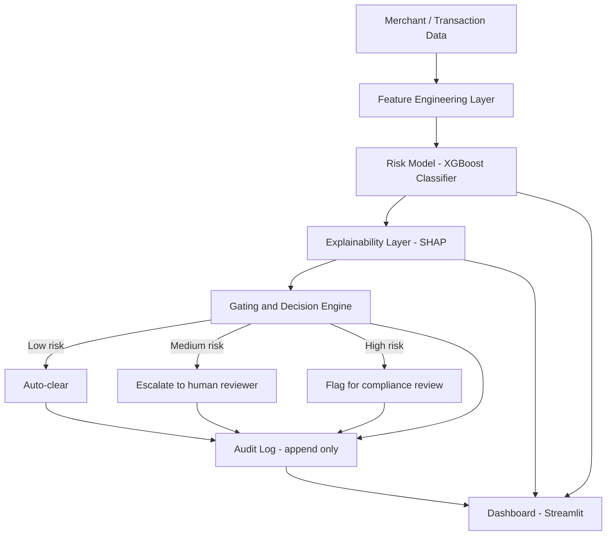
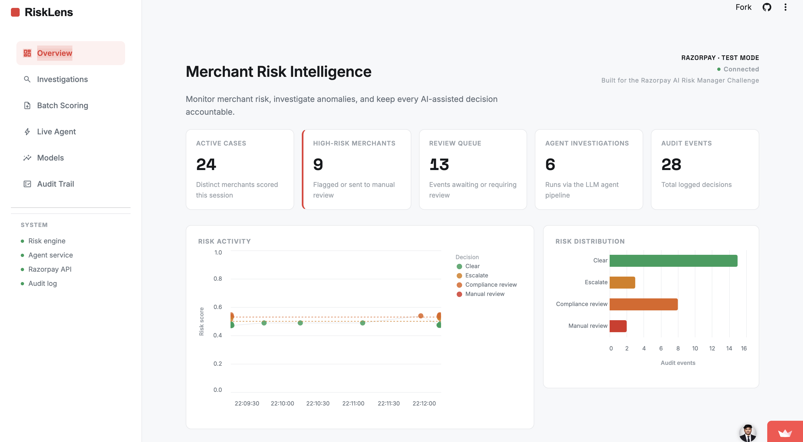
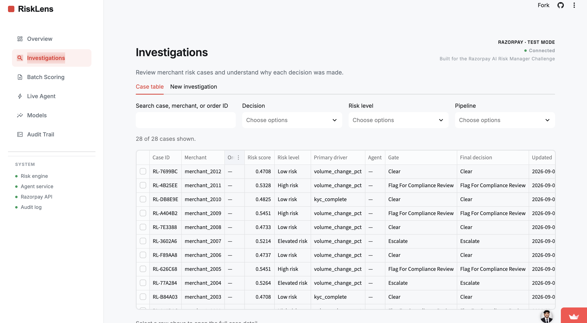
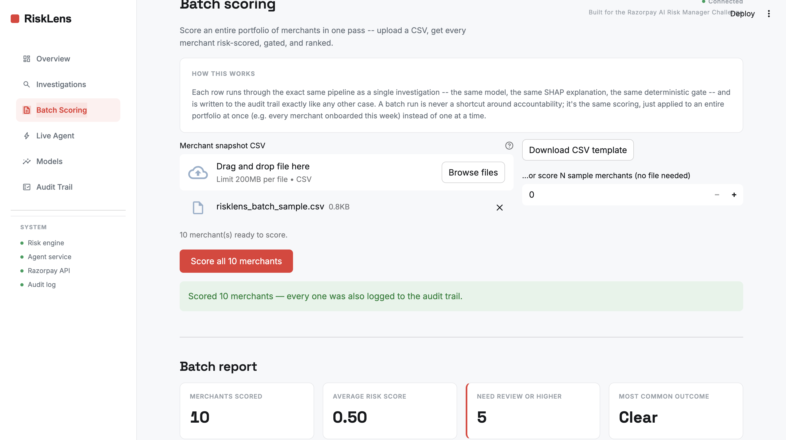
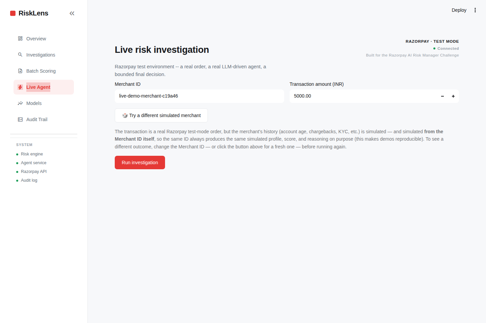
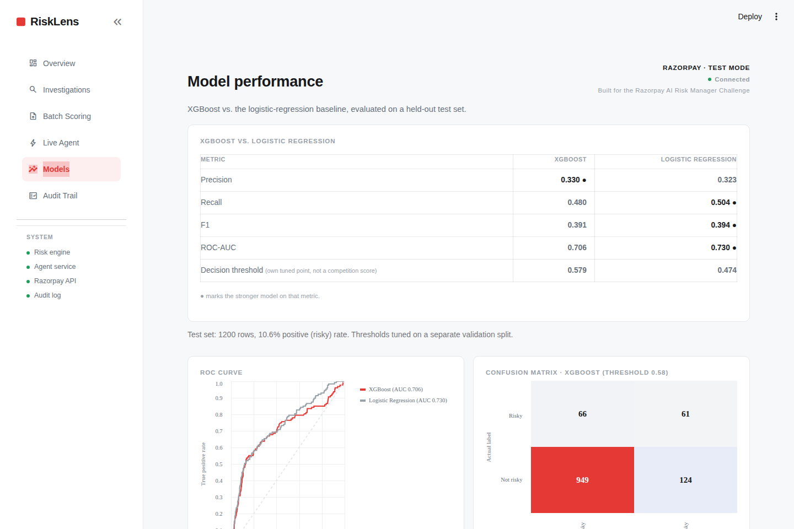
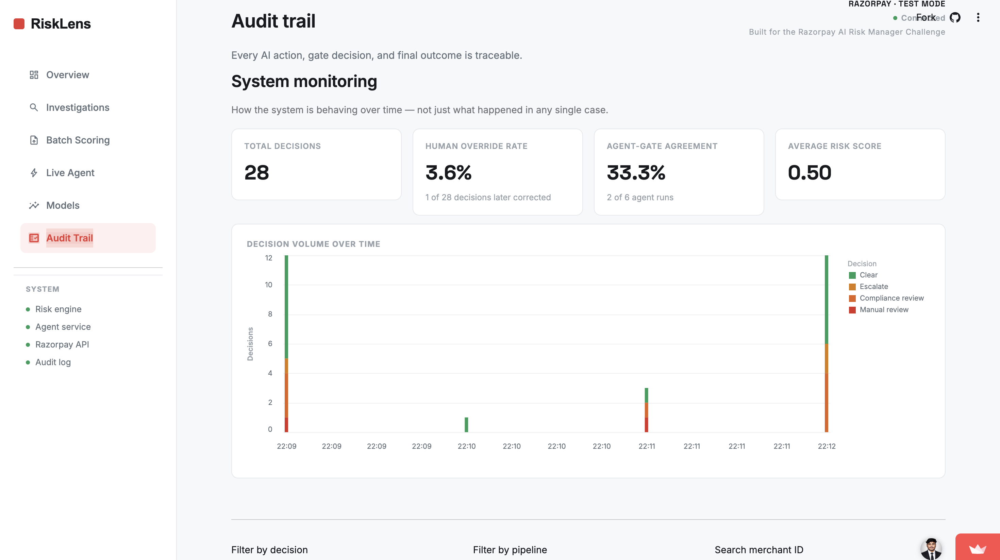

# RiskLens

[](https://github.com/Ranjithhub08/RiskLens/actions/workflows/tests.yml)
[](https://risklens-buildathon.streamlit.app)

**Explainable, accountable merchant risk & freeze-advisory engine — built for the Razorpay AI Buildathon, AI Risk Manager track.**

**[Try the live demo →](https://risklens-buildathon.streamlit.app)** — Overview, Investigations, Batch Scoring, and Models all work immediately with no setup on your end.

RiskLens scores merchant/transaction risk, explains every score in plain language, and never takes an irreversible action on its own. It classifies into clear / escalate / flag / needs-manual-review, always with a reason, and logs every decision to an append-only audit trail.

It ships two ways to reach that decision: a **deterministic pipeline** for instant, fully-scripted scoring, and an **agentic pipeline** where an LLM investigates a real Razorpay test-mode transaction using tools — streaming its reasoning live, pulling similar past cases for context — and proposes a decision, which the same fixed safety rules then check before anything counts as final.

That's the scoring half. The other half is what happens *after* a decision is made: a human reviewer can override any decision with a reason, on the record, without erasing the original; those corrections become labeled feedback; a candidate model can be retrained on that feedback and compared against what's live, with promotion to production always a separate, deliberate, human-triggered step. A monitoring view tracks how often that override happens and how often the agent's own recommendation agrees with the gate — so the system's health is visible over time, not just in a single demo run.

Full design rationale, data flow, the agent's reasoning-loop design, and a point-by-point mapping to the buildathon's judging criteria: see [`docs/ARCHITECTURE.md`](docs/ARCHITECTURE.md).

## Architecture



Every arrow into the Audit Log is intentional: nothing leaves the Gating and Decision Engine without being recorded first. The model and the agentic pipeline (Section 11 of the architecture doc) both only ever *propose* — this gating layer is the one authority neither can bypass. Full rationale for every box and arrow above: [`docs/ARCHITECTURE.md`](docs/ARCHITECTURE.md).

## Screenshots

| Overview | Investigations |
|---|---|
|  |  |

| Batch Scoring | Live Agent |
|---|---|
|  |  |

| Model performance | Audit Trail |
|---|---|
|  |  |

## Feature highlights

- **Explainable scoring** — XGBoost + SHAP; every score comes with its top contributing factors in plain language, not just a number.
- **Bounded, deterministic gate** (`DETERMINISTIC-GATE-02`) — a small, versioned rules layer is the only thing that turns a score into a real decision. The model and the agent both only ever *recommend*. The version number is bumped, and stamped onto every audit row, any time the thresholds or logic behind it change, so no past decision is ever misattributed to a rule set it wasn't actually decided under.
- **Live agent investigation** — an LLM (via Groq) investigates a real Razorpay test-mode order step by step, streaming its reasoning live rather than just returning a final answer, and can pull similar past cases in the same business category for context.
- **Human override** — a reviewer can correct any decision with a reason. The original decision is never edited or deleted; the correction is a new, separate, equally immutable record layered on top of it.
- **Ask about this case** — a natural-language Q&A box on the case detail panel, grounded only in that one case's own recorded data. It has no tools and cannot take or recommend any action -- purely a read-only explainer for a reviewer working through a case.
- **Retrain from feedback** — every override becomes a labeled training row. A candidate model can be retrained on the original data plus that feedback and compared against the currently deployed model on the same held-out test set. Promoting the candidate to production is a separate button — training never silently replaces what's live.
- **Batch scoring** — upload a CSV of merchants (or sample from the dataset) and score an entire portfolio in one pass through the exact same pipeline as a single case, with a ranked report and CSV export.
- **Threshold explorer** — an interactive slider showing the real precision/recall tradeoff at any decision threshold on the held-out test set, so a threshold choice is demonstrable rather than just asserted.
- **System monitoring** — portfolio-level health: human override rate, agent/gate agreement rate, and decision volume over time, distinct from the single-session snapshot on the Overview page.

## Quick start

One command:

```bash
./start.sh
```

This installs dependencies, generates the synthetic dataset, trains the model, and launches the dashboard at `http://localhost:8501` -- each step is skipped on re-run if its output already exists, so it's also just how you relaunch after a restart. Without a `.env` file, the dashboard still runs -- Overview, Investigations, Batch Scoring, Models, and Audit Trail all work with no configuration. Only Live Agent needs `GROQ_API_KEY` and your Razorpay TEST-mode keys; `start.sh` copies `.env.example` to `.env` for you to fill in, and the dashboard shows a clear message (not a crash) if they're missing.

Or step by step:

```bash
pip install -r requirements.txt

# 1. Generate the synthetic dataset (stands in for real Razorpay data)
python3 data/raw/generate_data.py

# 2. Train the model and produce the metrics/plots the dashboard displays
python3 model/train.py

# 3. Run the test suite (works fully offline -- the agent tests use a
#    scripted fake LLM client, no API key or network needed)
pytest tests/ -v

# 4. (Optional, for the "Live agent" tab) set up your own keys --
#    never commit this file or paste real keys anywhere
cp .env.example .env
# then edit .env and fill in GROQ_API_KEY and your Razorpay TEST-mode
# RAZORPAY_KEY_ID / RAZORPAY_KEY_SECRET

# 5. Launch the dashboard
streamlit run app/dashboard.py
```

Streamlit does not reload already-imported modules on its own -- after pulling changes or editing code, fully restart (`lsof -ti:8501 | xargs kill -9` then re-run) rather than just refreshing the browser tab.

Optional API layer:

```bash
uvicorn api.main:app --reload --port 8000
```

## What's in here

- `start.sh` — one-command setup + launch (installs dependencies, generates data, trains the model, and starts the dashboard, skipping any step whose output already exists)
- `data/raw/generate_data.py` — synthetic merchant-snapshot dataset generator (no external data or API keys needed)
- `features/features.py` — the one shared feature-engineering module used by both training and inference
- `model/train.py` — trains XGBoost + a logistic-regression baseline, time-based train/val/test split, threshold tuned on validation, metrics + plots saved to `model/artifacts/`
- `model/feedback.py` — turns human overrides into labeled training rows, retrains a candidate model on the original data plus that feedback, and (only on explicit request) promotes it to production
- `explainability/explain.py` — SHAP-based per-prediction explanations, translated to plain language
- `gating/decision_engine.py` — the bounding layer: plain rules mapping a score to clear/escalate/flag/manual-review, with a fail-safe path for low-confidence or invalid input. Used by **both** pipelines below — it's the one authority neither the deterministic path nor the agent can bypass.
- `audit/audit_log.py` — append-only SQLite audit trail (`audit_events`), plus a separate append-only `human_overrides` table for reviewer corrections — tagged by which pipeline produced each event
- `pipeline.py` — the deterministic scoring pipeline (used by the dashboard's Investigations and Batch Scoring pages, and the API)
- `agent/` — the agentic layer: `risk_agent.py` (the LLM reasoning loop, via Groq function calling, with a timestamped/timed tool-call trace and live step-by-step streaming), `tools.py` (what the agent is allowed to call, including looking up similar past cases), `merchant_context.py` (simulated merchant history), `case_qa.py` (read-only natural-language Q&A grounded in one case's own data, no tools, no actions)
- `integrations/razorpay_client.py` — real calls to Razorpay's test-mode API (Order creation)
- `agent_pipeline.py` — the agentic scoring pipeline (Razorpay + agent + gate + audit), used by the Live Agent page
- `config.py` — loads `GROQ_API_KEY` / `RAZORPAY_KEY_ID` / `RAZORPAY_KEY_SECRET` from a local `.env` file (see `.env.example`) — never hardcoded, never committed. Also refuses to start against a live-mode Razorpay key (anything not prefixed `rzp_test_`) — this is a test-mode-only demo by design, not just by convention.
- `app/dashboard.py` + `app/theme.py` — the console UI: a native sidebar-navigated app (Overview, Investigations, Batch Scoring, Live Agent, Models, Audit Trail) with real, interactive (Altair) charts throughout
- `api/main.py` — optional FastAPI `/score` endpoint, opening a fresh database connection per request so concurrent requests can't corrupt each other's audit rows
- `tests/` — 170 tests covering feature engineering (including cross-field validation, e.g. chargebacks can never exceed total transactions), gating logic (including NaN/boundary handling), the audit log and override table (including tie-break ordering), the deterministic pipeline, the agentic pipeline (including a Razorpay-failure case that must still reach the audit log), the agent loop (including that the final turn forces a real proposal instead of silently running out of turns), the case Q&A, the feedback/retrain flow with atomic all-or-nothing promotion, the dashboard's HTML-escaping of untrusted fields, crash-safe Audit Trail search, and honest tie-handling in the model comparison tables, the live-vs-test Razorpay key guard, and concurrent API load (with a scripted fake LLM client so the suite runs fully offline) (`pytest tests/`)

## What's real vs. simulated

The model, explainability layer, gating logic, and audit trail are fully functional and tested. The base dataset used to train the model is synthetic (generated with a fixed seed for reproducibility) since this project has no access to Razorpay's real transaction/KYC data. In the agentic pipeline, the *transaction* (Order amount, ID, timestamp) is real, live Razorpay test-mode data; the *merchant history* it's paired with is simulated, since no API hands a student project another business's real KYC/chargeback history. The human override and retrain-from-feedback loop is fully real and functional against whatever data is in the audit log -- it isn't scripted or simulated, it just starts empty until a reviewer actually uses it. See `docs/ARCHITECTURE.md` Sections 11-13 for the full, honest breakdown of what's real vs. simulated and why.

## Security note

`.env` is listed in `.gitignore` and will never be committed. If you ever paste an API key into a chat, a script, or a public repo, treat it as compromised and regenerate it immediately.

## License

[MIT](LICENSE)
