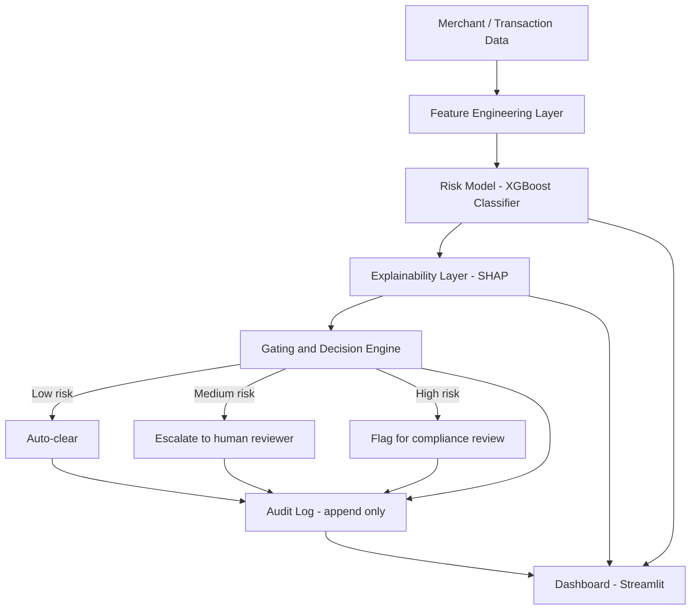

# RiskLens — Explainable Merchant Risk & Freeze Advisory Engine

**Track:** AI Risk Manager
**Buildathon:** Razorpay AI Buildathon 2026

---

## 1. Problem Statement

Payment platforms flag or freeze merchant accounts when activity looks risky — a sudden spike in transaction volume, an incomplete KYC document, an unusual chargeback pattern. These decisions protect the platform and its customers, but merchants are frequently left with two problems: they don't know *why* they were flagged, and there's no visible trail of *how* the decision was made. This erodes trust and turns a routine risk check into a support crisis.

RiskLens is a decision-support system that scores merchant/transaction risk, explains every score in plain language, and never takes an irreversible action on its own — it recommends, logs, and escalates, with a full audit trail behind every decision.

RiskLens ships two ways to reach a decision, sharing the same model, explainer, gating rules, and audit log underneath: a **deterministic pipeline** (`pipeline.py`, the "Score a case" tab) for instant, fully-scripted scoring, and an **agentic pipeline** (`agent_pipeline.py`, the "Live agent" tab) where an LLM reasons over a *real* Razorpay test-mode transaction, decides which tools to call, and proposes a decision — which the same fixed gating rules then check before anything is treated as final. Section 11 covers the agentic layer in full.

## 2. Goals and Non-Goals

**Goals**
- Predict risk with measurable accuracy (precision/recall on a held-out test set).
- Make every prediction explainable in plain language, not just a number.
- Bound the system's authority: it never auto-freezes anything. It classifies into clear / escalate / auto-flag bands and always leaves the final freeze decision to a human reviewer.
- Log every decision so it can be replayed and audited later.
- Fail safely: incomplete data or low model confidence routes to "needs human review," never to a silent guess.

**Non-Goals**
- This is not a production fraud system connected to real money movement. It uses public/synthetic data as a stand-in for Razorpay's real signals.
- It does not attempt to *execute* account actions (freeze/unfreeze) — only to recommend and explain them.
- The agent (Section 11) is not given final authority over any decision. It reasons and proposes; the deterministic gate decides. This is intentional — see Section 11's design rationale.

## 3. High-Level Architecture



Every arrow into the Audit Log is intentional: nothing leaves the Gating and Decision Engine without being recorded first.

This diagram is the deterministic path. The agentic path (Section 11) replaces step B→C with an LLM-driven reasoning loop that *decides* to call the model and explainer as tools, but still ends at the same Gating and Decision Engine and the same Audit Log — the safety boundary doesn't move just because the decision-making got smarter.

## 4. Component Breakdown

### 4.1 Data Layer
- **Source:** a public fraud-detection dataset (e.g., Kaggle's Credit Card Fraud Detection set) used as a proxy for transaction-level signals, supplemented with a synthetic merchant-profile generator you write yourself (fields like `account_age_days`, `kyc_status`, `daily_txn_volume`, `volume_change_pct`, `chargeback_rate`, `refund_rate`, `avg_ticket_size`).
- **Why synthetic + public combined:** the public dataset gives you a realistic transaction-fraud signal distribution; the synthetic layer lets you simulate the specifically merchant/KYC-flavored features Razorpay's real problem would use, which no public dataset covers.
- **Output:** a single merged, labeled table: one row per merchant-day or per transaction, with a binary label (`risky` / `not risky`) used for training and evaluation.

### 4.2 Feature Engineering Layer
- Rolling-window features (7-day and 30-day transaction volume, rate of change).
- Ratio features (chargeback rate, refund rate, failed-payment rate).
- Categorical encodings (KYC completeness tier, business category).
- All transformations live in one `features.py` module so training and inference use *identical* logic — a common source of silent bugs when the two drift apart.

### 4.3 Model Layer
- **Algorithm:** XGBoost classifier (binary: risky vs. not risky), with a simpler logistic regression baseline trained alongside it purely for comparison — this gives you a credible "we tried a simple baseline and beat it by X%" line for the panel.
- **Split strategy:** time-based train/test split (train on earlier data, test on later data) rather than random split — this is more realistic for a fraud/risk use case and shows methodological maturity if a judge asks about it.
- **Evaluation metrics:** precision, recall, F1, ROC-AUC, and a confusion matrix, all computed on the held-out test set and saved to a metrics report — this directly satisfies the track's stated judging bar.
- **Artifact:** trained model saved via `joblib`, versioned with a timestamp, loaded by both the API/dashboard and any batch scoring script.

### 4.4 Explainability Layer
- **Method:** SHAP (SHapley Additive exPlanations) computed per-prediction, giving the top 3–5 features that pushed the score up or down.
- **Translation to plain language:** a small templating function maps feature names + SHAP direction into human sentences, e.g. `"Flagged mainly because daily transaction volume increased 420% over the account's 30-day average, and KYC documentation is marked incomplete."`
- **Confidence reporting:** alongside the risk score, report the model's predicted probability, so "60% risky" reads differently from "97% risky" in the explanation.

### 4.5 Gating and Decision Engine — the key differentiator
This is the layer that turns a raw model score into a bounded, safe recommendation. It is a plain rules layer sitting on top of the model, deliberately simple and auditable rather than another opaque model:

| Risk score | Decision | System behavior |
|---|---|---|
| < 0.40 | Clear | Logged, no action, no alert |
| 0.40 – 0.75 | Escalate | Routed to a human reviewer queue with the full explanation attached |
| > 0.75 | Flag for compliance review | Routed as high-priority, explanation + supporting SHAP chart attached |
| Missing/invalid input, or model confidence below a defined floor | Needs manual review (fail-safe) | Never auto-scored; explicitly routed to a human with a reason: "insufficient data to score" |

The thresholds (0.40 / 0.75) are configuration, not hard-coded logic — deliberately, so you can show a judge you thought about tunability and false-positive/false-negative tradeoffs. Nowhere in this system does a score alone freeze an account; it only ever produces a recommendation plus a reason.

### 4.6 Audit Trail Layer
- Append-only log (SQLite table or JSON-lines file) recording, per event: input snapshot, feature values used, raw model score, SHAP top-factors, gating decision, timestamp, and a unique event ID.
- Nothing is ever overwritten or deleted — only appended — so any decision can be replayed and inspected later, which is the literal definition of an audit trail.
- A small query script/dashboard tab lets you pull "show me every decision for merchant X" or "show me every high-risk flag in the last 7 days."

### 4.7 Application Layer
- **Streamlit dashboard** with four views:
  1. **Score a case** — pick or input a merchant/transaction, see the risk score, the plain-language explanation, and the gating decision, via the deterministic pipeline.
  2. **Live agent** — creates a real Razorpay test-mode Order and runs the LLM reasoning loop over it end to end; see Section 11.
  3. **Model performance** — precision/recall/F1/ROC curve/confusion matrix from the held-out test set, shown visually. This is what you point to when a judge asks "how do you know it works."
  4. **Audit log viewer** — searchable history of past decisions from *either* pipeline (tagged by `source`), proving the audit trail is real and queryable, not just a design claim.
- **Optional API layer** (FastAPI) wrapping the model as a `/score` endpoint — not required, but makes the project look production-shaped if you have time, and gives you something concrete to describe in a panel interview about how this would plug into a real system.

## 5. End-to-End Data Flow (one request, step by step)

1. A merchant/transaction record enters the system (from the dashboard input or a batch file).
2. Feature Engineering Layer computes the model's input features from raw fields.
3. The Model Layer scores it, producing a probability (0–1) of being risky.
4. The Explainability Layer computes SHAP values for that specific prediction and generates a plain-language reason.
5. The Gating and Decision Engine applies the threshold table above and outputs one of: clear / escalate / flag / needs-manual-review.
6. The Audit Layer records the entire event (inputs, score, explanation, decision, timestamp) before anything is returned to the caller.
7. The Dashboard displays the score, explanation, and decision to the user, and the event becomes queryable in the audit log view.

## 6. Failure Handling and Edge Cases

- **Missing fields:** validated before scoring; if required fields are absent, the system routes straight to "needs manual review" rather than guessing or imputing silently.
- **Out-of-range values:** clipped/flagged rather than crashing the pipeline.
- **Low-confidence predictions:** a configurable confidence floor (e.g., predictions between 0.45–0.55, close to the decision boundary) are also routed to manual review rather than trusted outright — the model admits uncertainty instead of forcing a decision.
- **Model/data drift (mentioned, not fully implemented):** the architecture reserves a place for periodic re-evaluation against fresh held-out data; noted explicitly in Limitations as a real production requirement this demo doesn't fully implement.

## 7. Evaluation Methodology

- Time-based 80/20 train/test split.
- Metrics reported: precision, recall, F1-score, ROC-AUC, confusion matrix — all on the untouched test set.
- Baseline comparison: logistic regression vs. XGBoost, to show the chosen model's lift over a simple baseline.
- Global feature importance (SHAP summary plot) reported separately from per-case local explanations, to show both "what matters overall" and "what mattered for this one decision."

## 8. Repository Structure

```
risklens/
├── data/
│   ├── raw/                  # synthetic dataset generator + generated CSV
│   └── processed/            # merged, labeled training table
├── features/
│   └── features.py           # shared feature engineering (train + inference)
├── model/
│   ├── train.py               # training + evaluation script
│   └── artifacts/              # saved model, metrics, plots
├── explainability/
│   └── explain.py              # SHAP wrapper + plain-language templating
├── gating/
│   └── decision_engine.py       # threshold logic, fail-safe routing (used by BOTH pipelines)
├── audit/
│   └── audit_log.py             # append-only logging + query helpers
├── agent/
│   ├── risk_agent.py             # the LLM reasoning loop (Groq, function calling)
│   ├── tools.py                   # tool definitions the agent may call
│   └── merchant_context.py         # simulated merchant history lookup
├── integrations/
│   └── razorpay_client.py          # real Razorpay test-mode API calls (Order creation)
├── pipeline.py                       # deterministic scoring pipeline
├── agent_pipeline.py                  # agentic scoring pipeline (Razorpay + agent + gate + audit)
├── config.py                            # loads secrets from .env (never hardcoded)
├── app/
│   └── dashboard.py                      # Streamlit app (4 tabs)
├── api/                                    # optional
│   └── main.py                              # FastAPI /score endpoint
├── tests/
│   ├── test_features.py
│   ├── test_gating.py
│   ├── test_audit_log.py
│   ├── test_pipeline.py
│   └── test_agent.py                          # agent loop tests, scripted fake LLM client
├── docs/
│   └── ARCHITECTURE.md                          # this document
├── .env.example                                   # template for local secrets (never committed)
├── requirements.txt
└── README.md
```

## 9. Tech Stack Summary

| Layer | Tool |
|---|---|
| Language | Python |
| Data handling | pandas, numpy |
| Model | XGBoost (+ scikit-learn baseline) |
| Explainability | SHAP |
| Agent / orchestration | Hand-rolled reasoning loop over Groq's chat-completions API with function calling (no LangChain/CrewAI — see Section 11 for why) |
| Live data source | Razorpay test-mode API (Orders), via the official `razorpay` Python SDK |
| Decision logic (gate) | plain Python rules (no ML — deliberately transparent), the final authority regardless of pipeline |
| Secrets | `.env` + `python-dotenv`, never hardcoded or committed |
| Audit trail | SQLite |
| Dashboard | Streamlit |
| Optional API | FastAPI |
| Testing | pytest (agent tests use a scripted fake LLM client — no network/API key needed to run the suite) |
| Version control | Git / GitHub (public repo) |

## 10. Alignment to Buildathon Requirements

| Requirement (from the buildathon) | How RiskLens satisfies it |
|---|---|
| "Precision and recall on a held-out test set" | Section 7 — explicit time-based split, reported metrics, baseline comparison |
| "Every money action explainable, bounded and gated" | Sections 4.4–4.5 — SHAP-based explanations + a rules-based gating layer that never auto-freezes |
| "Documented audit trails" | Section 4.6 — append-only log, queryable via dashboard, now also carrying the agent's full reasoning trace |
| "Graceful failure handling" | Section 6 — explicit fail-safe routing on missing data / low confidence, and on agent turn-exhaustion or malformed output (Section 11) |
| "Practical functionality and transparent limitations" | Section 12 below |
| "Agentic workflows — an agent loop, not fixed logic" | Section 11 — an LLM decides which tools to call and in what order; nothing about the investigation sequence is hard-coded |
| "Live prototyping — real APIs, not mock" | Section 11.2 — every "Live agent" run creates a genuine Order against Razorpay's test-mode API and gets a real Order ID back |

## 11. Agentic Layer: LLM Reasoning Loop

### 11.1 Why an agent, and why it still doesn't have the final word

A fixed rules engine (Section 4.5) is safe and auditable, but it isn't "AI deciding something" — it's a lookup table. The buildathon's own framing (two of five tracks are literally "Agentic Commerce," and Razorpay's own products describe agents running in "a reasoning loop") asks for the AI itself to decide what to investigate and in what order, not just to classify.

So RiskLens adds a second path, alongside the deterministic one, where an LLM (via Groq, using `llama-3.3-70b-versatile` with function calling) is given a transaction and four tools, and has to figure out what to do:

1. `get_merchant_context` — look up the merchant's history
2. `score_transaction_risk` — run the trained model (the same model as the deterministic path)
3. `explain_transaction_risk` — get the SHAP-based plain-language reasoning
4. `get_recent_audit_history` — check this merchant's past decisions for context

Nothing about the sequence is hard-coded in application logic — the agent is instructed on the *goal* (investigate, then propose) and decides the *path* itself, including whether to check audit history at all. That's the actual agent loop: `agent/risk_agent.py`'s `run_risk_agent` sends the conversation to the LLM, executes whatever tool calls come back, feeds the results back in, and repeats until the LLM stops calling tools and gives a final answer (capped at `MAX_TURNS` to prevent a runaway loop — itself a bounding mechanism).

Critically, the agent's final answer is a *proposal*, not an action. `run_risk_agent` takes the risk score the agent computed via its own tool call and independently runs it through `gating.decision_engine.decide_from_score` — the exact same deterministic function the non-agentic path uses. If the agent's proposed decision and the gate's decision disagree, both are recorded, but **the gate's decision is what's treated as real** (`gated_decision` in the result, vs. `agent_proposal` which is kept purely as the recorded reasoning). `tests/test_agent.py::test_gate_overrides_agent_when_they_disagree` proves this holds even when the agent is deliberately scripted to say "clear" regardless of the actual score.

This is the resolution to a real tension: "must be agentic" and "must be bounded and gated" can sound like they pull in opposite directions. The answer here is a division of labor — the LLM investigates and explains (which needs judgment and language), and a small, auditable, non-LLM function enforces the actual boundary (which needs to be reliable and impossible to talk out of). Neither requirement is watered down to satisfy the other.

### 11.2 Live data: real Razorpay test-mode Orders

`integrations/razorpay_client.py` calls Razorpay's actual test-mode API — `client.order.create(...)` via the official `razorpay` Python SDK — and gets back a real Order ID, not a fixture. This is a genuine, authenticated round trip to Razorpay's infrastructure, run fresh every time the "Live agent" tab is used.

One honest boundary, stated plainly rather than glossed over: capturing an actual payment against that order requires the customer-facing checkout flow (every payment gateway requires this, by design, so a backend can't silently charge a card). So the "live" half of each case is the transaction event — a real Order, a real amount, a real timestamp, a real Order ID — while the *merchant history* half (KYC status, 30-day chargeback rate, account age) is necessarily simulated, since no API — sandbox or otherwise — hands out another business's KYC data to a student project, for good reason. `agent/merchant_context.py` isolates that simulated half into one small, clearly-labeled file specifically so this boundary is easy to point to rather than easy to lose track of.

### 11.3 Why no LangChain/CrewAI/vector database

The agent loop is hand-rolled directly against Groq's function-calling API rather than built on an orchestration framework. This was a deliberate choice, not a shortcut: a ~150-line loop that's fully readable end-to-end is easier to defend under panel questioning ("walk me through exactly what happens when the agent calls a tool") than "the framework handles that part." No vector database is used because nothing in this system needs semantic retrieval over unstructured documents — the "memory" the agent needs (a merchant's past decisions) is a handful of structured rows from the audit log, which SQL already answers directly. Reaching for a vector DB here would add a dependency without adding capability.

### 11.4 Failure handling specific to the agent

- **Malformed final response:** if the LLM's last message isn't valid JSON in the expected shape, `agent_proposal` is set to `None` rather than guessed at, and the gate's decision (computed independently from the actual risk score) is still returned. See `test_malformed_final_response_does_not_crash`.
- **Turn exhaustion:** if the agent never produces a final answer within `MAX_TURNS`, the system fails safe to `needs_manual_review` (or the gate's decision, if a risk score was already computed before turns ran out). See `test_running_out_of_turns_fails_safe_to_manual_review`.
- **Tool errors:** if a tool call fails (e.g. the agent passes incomplete fields to `score_transaction_risk`), the error is caught and fed back to the agent as a tool result rather than crashing the loop. See `test_tool_error_is_captured_not_raised`.
- **Missing configuration:** if `GROQ_API_KEY` or the Razorpay keys aren't set, the dashboard's "Live agent" tab shows a clear message and disables itself rather than crashing — the other three tabs are unaffected.

## 12. Limitations and Future Work

- Trained on public/synthetic data as a stand-in for Razorpay's real transaction and KYC signals; real-world performance would need retraining on actual platform data.
- The gating thresholds (0.40 / 0.75) are illustrative starting points, not tuned against a real cost-of-false-positive vs. cost-of-false-negative analysis, which a production deployment would require.
- No real-time streaming — this demo scores on request/batch, not on a live transaction stream.
- Model/data drift monitoring is designed for but not fully implemented in this version.
- Future extension: graph-based "abuse-ring" detection (linking related accounts), which the buildathon also lists as an example under this track.
- The agentic path's *transaction* data (Order amount, ID, timestamp) is real, live Razorpay test-mode data; the *merchant history* it's paired with (KYC status, chargeback rate, account age) is simulated per Section 11.2's explanation — no publicly available API, sandbox or otherwise, provides real merchant KYC/risk history to a student project.
- The agent's investigation quality depends on the underlying LLM (Groq/Llama 3.3 70B here); a different or future model could investigate more or less thoroughly for the same prompt. The gate's behavior does not depend on the LLM at all, which is exactly why the gate — not the agent — is the safety boundary.
- `MAX_TURNS` is a fixed cap (6) chosen for demo responsiveness; a production system would likely tune this against real latency/cost/thoroughness tradeoffs.

---

*This document is written to be read alongside the project's public repository and 5-minute pitch video, as required by the Razorpay AI Buildathon submission process.*
